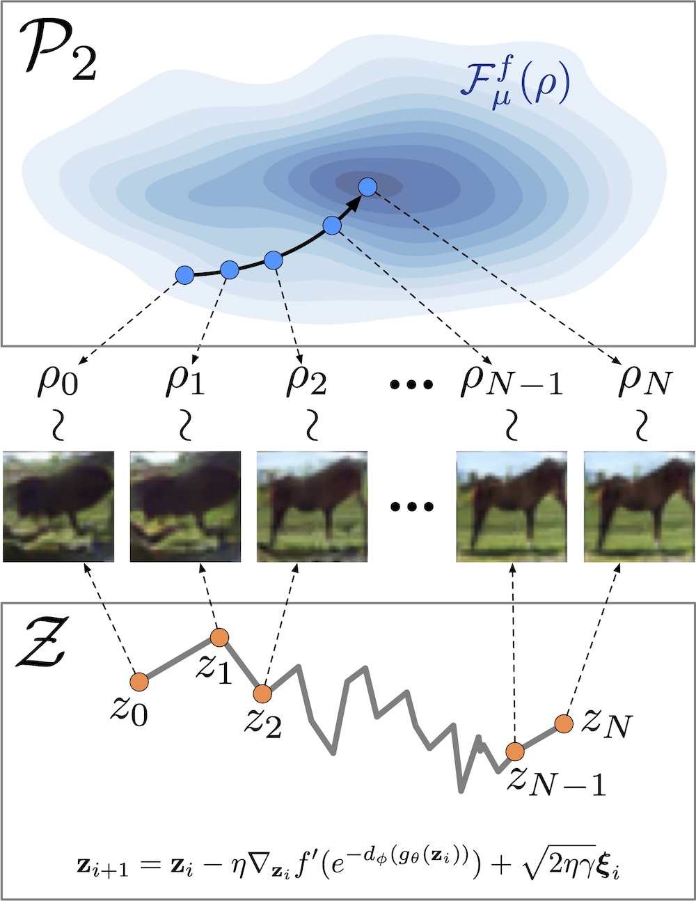
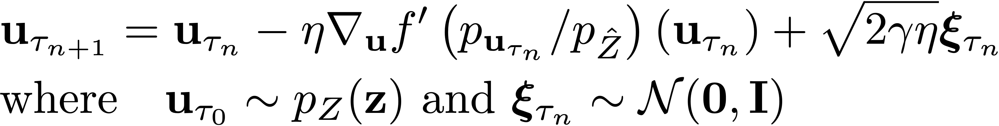
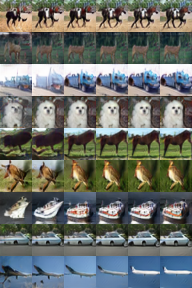
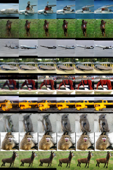

# Discriminator Gradient flow (DGflow)

[](https://arxiv.org/abs/2012.00780)
[](https://opensource.org/licenses/MIT)
[](https://openreview.net/forum?id=Zbc-ue9p_rE)

<p align="center">
  
  <br />
  <span>Fig 1. An illustration of refinement using DGflow, with the gradient flow in the 2-Wasserstein space (top) and the corresponding discretized SDE in the latent space (bottom).</span>
</p>

This repository contains code for reproducing the experiments presented in the ICLR 2021 paper *[Refining Deep Generative Models via Discriminator Gradient Flow](https://openreview.net/forum?id=Zbc-ue9p_rE)*. In this paper, we propose DGflow, a technique to improve samples from deep generative models using the gradient flow of entropy-regularized f-divergences between the generated and real data distributions. The gradient flow has an equivalent Stochastic Differential Equation (SDE) which can be simulated using the Euler-Maruyama method. We simulate the SDE in the latent space of the generative model as follows:

<p align="center">
  
</p>

The density ratio term in the above equation is estimated using a pretrained discriminator. 

We further propose a technique to extend DGflow to deep generative models lacking a corresponding discriminator such as VAEs, Normalizing Flows, and GANs with vector-valued critics. For such generative models, we use a (pretrained) discriminator trained on the same dataset as the generative model combined with a density ratio corrector which corrects the density ratio estimate. Please check out [the paper](https://openreview.net/forum?id=Zbc-ue9p_rE) for more details and empirical results.

<p float="left" align="center">
  
  
  <br />
  <span>Fig 2. Improvement in the quality of samples generated from the base model (leftmost columns) over the steps of DGflow for the CIFAR10 (left) and STL10 (right) datasets.</span>
<p>

## Environment Setup

* Install Libraries:
```bash
pip install -r requirements.txt
```

* Run the following commands.
```bash
$ python download_dataset.py --root torchdata/ --data cifar10  # Download CIFAR10
$ python download_dataset.py --root torchdata/ --data stl10  # Download STL10
$ python scale_stl10.py --gpu 0  # Scale STL10 to 48 x 48 and 32 x 32
$ mkdir metric
$ python download_inception.py --outfile metric/inception_score.model    # Download inception model
$ python extract_inception_feats.py --data CIFAR --gpu 0  # Extract inception features for CIFAR10
$ python extract_inception_feats.py --data STL48 --gpu 0  # Extract inception features for STL10 48 x 48
$ python extract_inception_feats.py --data STL32 --gpu 0  # Extract inception features for STL10 32 x 32
```
* Download pretrained SNGAN models from [Tanaka, 2019]'s [official repository](https://github.com/AkinoriTanaka-phys/DOT).
* Download pretrained MMDGAN, OCFGAN, and VAE generators and density ratio correctors from [Releases](https://github.com/clear-nus/DGflow/releases/tag/v1.0).
* Move the pretrained models to `./trained_models/`.

## Usage

To refine samples using DGflow run the following:

```
python dgflow.py --config <path to config file>
```

Example for SN-DCGAN (hinge):

```
python dgflow.py --config configs/sngan-hi.yml
```

The results will be saved in `./exps/`.

### Example of a Config File

```yaml
dataset: cifar10
image_size: 32
eval_file_prefix: CIFAR
gen_type: t_cnn # Type of generator
gen_path: trained_models/OCFGAN_CIFAR.pth # Path to generator checkpoint
disc_type: c_sndcgan # Type of discriminator
disc_path: trained_models/DCGAN_D_CIFAR_SNGAN_NonSaturating_150001.npz # Path to discriminator checkpoint
corr_type: t_sndcgan # Type of density ratio corrector
corr_path: trained_models/OCFGAN_CIFAR_DRC.pth # Path to density ratio corrector checkpoint
f_div: KL # One of 'KL', 'logD', or 'JS'
eta: 0.1 # Step-Size
gamma: 0.01 # Noise regularizer
save_interval: 5 # Save samples every save_interval steps
keep_samples: true # Keep samples on disk after execution
steps: 25 # Number of update steps
bottom_width: 4 
num_imgs: 50000 # Number of images to generate
batch_size: 500
exp_root: ./exps/
z_dim: 32 # Dimension of the prior distribution
```

### Questions

For any questions regarding the code or the paper, please email [Abdul Fatir](mailto:abdulfatir@u.nus.edu).

### BibTeX

If you find this repository or the ideas presented in our paper useful for your research, please consider citing our paper.

```
@inproceedings{
ansari2021refining,
title={Refining Deep Generative Models via Discriminator Gradient Flow},
author={Abdul Fatir Ansari and Ming Liang Ang and Harold Soh},
booktitle={International Conference on Learning Representations},
year={2021},
url={https://openreview.net/forum?id=Zbc-ue9p_rE}
}
```

### Acknowledgement 

This repo contains code that's based on the following repos:

| Repo  | Copyright (c) | License |
| ------------- | ---------- | ------------- |
| [AkinoriTanaka-phys/DOT](https://github.com/AkinoriTanaka-phys/DOT)  |  2019 AkinoriTanaka-phys  | [MIT License](https://github.com/AkinoriTanaka-phys/DOT/blob/master/LICENSE) |
| [pfnet-research/sngan_projection](https://github.com/pfnet-research/sngan_projection)  | 2018 Preferred Networks, Inc.  | [MIT License](https://github.com/pfnet-research/sngan_projection/blob/master/LICENSE.md) |
| [pfnet-research/chainer-gan-lib](https://github.com/pfnet-research/chainer-gan-lib) | 2017 pfnet-research  | [MIT License](https://github.com/pfnet-research/chainer-gan-lib/blob/master/LICENSE) |

### References
**[Miyato et al., 2018]** Takeru Miyato, Toshiki Kataoka, Masanori Koyama, and Yuichi Yoshida. Spectral normalization for generative adversarial networks. In ICLR, 2018.    
**[Tanaka, 2019]** Akinori Tanaka. Discriminator optimal transport. In NeurIPS, 2019.    
**[Ansari et al., 2020]** Abdul Fatir Ansari, Jonathan Scarlett, and Harold Soh. A characteristic function approach to deep implicit generative modeling. In CVPR, 2020.